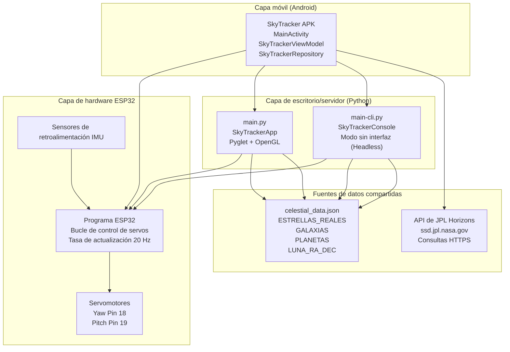
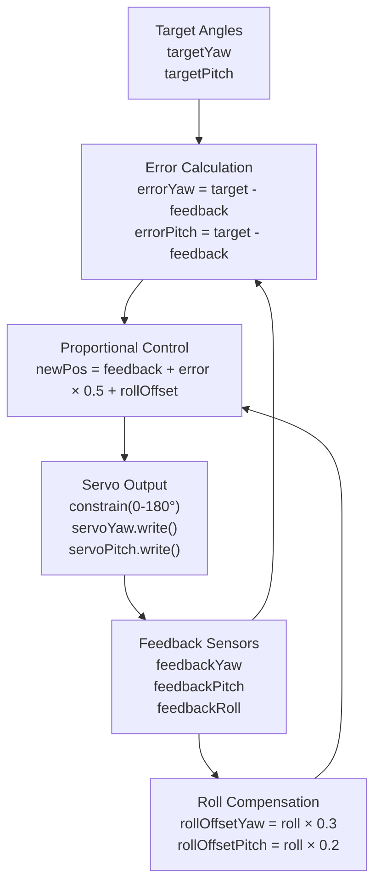
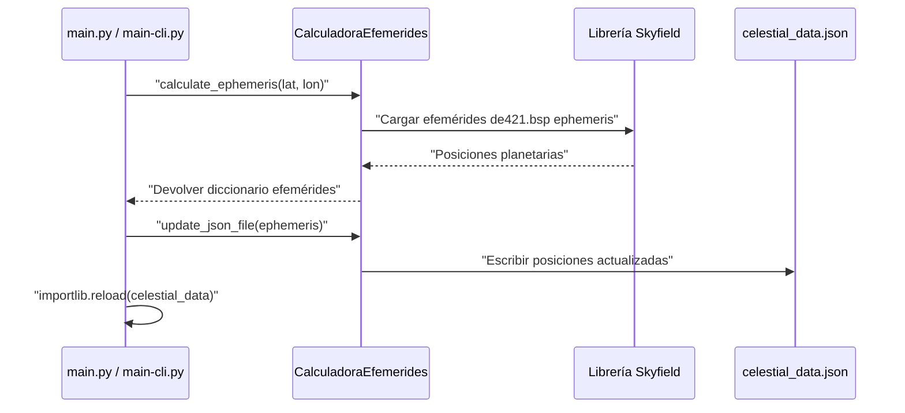

# SkyTracker  

### Rastreador multiplataforma de cuerpos celestes en tiempo real  


> 🪐 Proyecto desarrollado por el **Grupo 7** para la cátedra *"Tecnologías para la Automatización"* en la carrera de Ingeniería en Sistemas de Información de la Facultad Regional de Concepción del Uruguay. Inspirado en el diseño *StarTrack* de [Görkem Bozkurt](https://gorkem.cc/projects/StarTrack/) (modelo 3D).    
> Licencia [MIT](LICENSE.md) | Código libre, abierto y extensible.


## Descripción General  

**SkyTracker** permite rastrear y visualizar objetos celestes (planetas, estrellas, galaxias) en tiempo real desde distintas plataformas:

- **Aplicación 3D en Python** (OpenGL + Pyglet)  
- **Aplicación Android nativa** (Jetpack Compose). 
- **Control físico con ESP32** (servos + sensores)

El sistema puede calcular efemérides astronómicas, renderizar el cielo en 3D y mover una montura servo-motorizada para apuntar al objeto seleccionado.


## Cómo Usar

#### SkyTracker físico

1. Descargar e imprimir las piezas en ``esp32/CAD`` (*base_screw.stl* es opcional si posee un trípode)

2. Flashear **ESP32** utilizando ``Arduino IDE`` y el código en ``esp32/firmware.ino``

3. Seguir la guía de armado https://gorkem.cc/projects/StarTrack/

4. Conectar **ESP32** a una fuente de alimentación vía:

   a) una *computadora* por medio de USB tipo C

   b) una *batería* de 5V

5. Listo!

Más información en ```/esp32/README.md```.

#### Android

1) Descargar ``app-release.apk`` en Releases
2) Abrir la app **SkyTracker** 
3) Seleccionar *Modo de Operación: **DIRECTO***
4) Tocar "CONECTAR"
5) Escribir en el cuadro de búsqueda el objeto a rastrear
6) Listo!

Más información en ```/android/README.md```.

 #### Python

1. Clonar el repositorio
2. Instalar dependencias
3. Editar el archivo ```config.py```
4. Abrir ```main.py``` o ```main-cli.py```
5. Listo!

Más información en ```/python/README.md```.


## Índice

* 1. **[Propósito y Alcance](#1.-Propósito-y-Alcance)**
* 2. **[Descripción del Proyecto](#2.-Descripción-de-Proyecto)**
* 3. **[Stack Tecnológico](#3-Stack-Tecnológico)**
* 4. **[Componentes del Sistema](#3.-Componentes-del-Sistema)**
* 5. **[Descripción general de Arquitectura](#4.-Descripción-general-de-Arquitectura)**
* 6. **[Características Principales](#5.-Características-Principales)**
* 7. **[Modos de Operación](#6.-Modos-de-Operación)**
* 8. **[Fuentes de Datos y Caché](#8.-Fuentes-de-Datos-y-Caché)**
* 9. **[Protocolos de Comunicación](#9.-Protocolos-de-Comunicación)**
* 10. **[Renderizado y Visualización](#10.-Renderizado-y-Visualización)**
* 11. **[Elementos de Interfaz de Usuario](#11.-Elementos-de-Interfaz-de-Usuario)**
* 12. **[A grandes rasgos](#12.-A-grandes-rasgos)**

---


## 1. Propósito y Alcance

El propósito de **SkyTracker** es desarrollar un sistema automatizado y multiplataforma capaz de calcular, visualizar y seguir en tiempo real la posición de cuerpos celestes, integrando software y hardware de bajo costo.

El proyecto aplica los principios de **automatización y control** al ámbito de la **astronomía amateur**, ofreciendo una herramienta abierta, extensible y de libre uso que permite a los usuarios construir su propia montura “Go-To” casera para telescopios o cámaras astronómicas.

Su alcance abarca desde la **visualización virtual del cielo** hasta el **control físico** de una montura servo-motorizada basada en ESP32, actuando como complemento de los equipos astronómicos existentes y promoviendo el enfoque **DIY (hazlo tú mismo)**. Su diseño modular posibilita la incorporación de futuros subsistemas (como sensores, guiado automático, registro fotográfico o control remoto) que amplíen las capacidades del mismo.


## 2. Descripción de Proyecto

SkyTracker es un sistema interactivo de seguimiento de objetos celestes que combina visualización 3D, cálculos astronómicos y control físico de hardware. El sistema permite a los usuarios localizar y seguir estrellas, planetas, galaxias y otros objetos celestes mediante múltiples interfaces que se comunican con un sistema de control servo basado en ESP32.

El caso de uso principal consiste en que el usuario seleccione un objeto celeste por su nombre; a continuación, el sistema calcula su posición actual en el cielo, la convierte en ángulos de apuntado (azimut y altitud) y ordena a una montura física con servos que apunte al objetivo. El sistema proporciona información en tiempo real de los sensores, creando un sistema de control de bucle cerrado.


## 3. Stack Tecnológico

La siguiente tabla resume las tecnologías básicas y librerías usadas por cada componente:

| Componente       | Lenguaje      | Tecnologías clave                                     |
| ---------------- | ------------- | ----------------------------------------------------- |
| Python GUI       | Python 3.10+  | Pyglet, OpenGL, Skyfield                              |
| Python CLI       | Python 3.10+  | Librería Standard, hilos                              |
| App Android      | Kotlin        | Jetpack Compose, Kotlin Coroutines, StateFlow, OkHttp |
| Firmware ESP32   | C++ (Arduino) | Librería Servo.h, framework de Arduino                |
| Formato de Datos | JSON          | Esquema celestial_data.json                           |
| API Externa      | HTTPS         | Servicio de efemérides JPL Horizons                   |


## 4. Componentes del Sistema

SkyTracker consiste de tres capas de plataforma principales:

#### a) Aplicaciones de Escritorio de Python

Dos aplicaciones de Python proporcionan funcionalidad de escritorio y servidor:

* **`main.py`**: Aplicación gráfica 3D desarrollada con Pyglet y OpenGL. Ofrece visualización astronómica con un entorno HDR renderizado con efecto bloom, seguimiento de objetos celestes en tiempo real, controles de cámara y búsqueda de objetos. Implementa la clase `SkyTrackerApp` como controlador principal de la aplicación.
* **`main-cli.py`**: Aplicación de consola sin interfaz gráfica para entornos con recursos limitados. Ofrece la misma funcionalidad de seguimiento sin gráficos, ideal para su implementación en servidores o placas de desarrollo como Raspberry Pi. Implementa la clase `SkyTrackerConsole`.

Ambas aplicacionees pueden operar como:

1. Controladores de hardware directos (serial/TCP a ESP32)
2. Servidores TCP para clientes Android (puerto 12345)

####  b) Aplicación de Dispositivo Móvil de Android

Una aplicación nativa de Android construida con Jetpack Compose que provee acceso móvil al sistema de rastreo. La aplicación implementa la arquitectura MVVM con:

* `MainActivity`: Punto de entrada de la Interfaz de Usuario con Jetpack Compose
* `SkyTrackerViewModel`: Manejo de estados utilizando `StateFlow` de Kotlin
* `SkyTrackerRepository`: Lógica de negocio e intercambio de modos de operación
* `ESP32Connection` / `ServerConnection`: Capa de Red para la comunicación

La aplicación de Android soporta dos modos de operación vía el enum `OperationMode`:  modo`SERVER` (delega cálculos a Python) y el modo `DIRECTO` (realiza cálculos locales y controla directamente al ESP32).

#### c) Controlador de Hardware ESP32

Un microcontrolador ESP32 que implementa el control de servos en lazo cerrado. El firmware lee los ángulos objetivo mediante comunicación serie/TCP, controla dos servos (guiñada y cabeceo), lee la retroalimentación de los potenciómetros o sensores IMU y aplica compensación de balanceo para corregir la inclinación del soporte.

The control algorithm runs at approximately 20Hz (50ms loop delay) and uses proportional control with Kp=0.5.


## 4. Descripción General de Arquitectura

El siguiente diagrama muestra como las 3 capas de plataforma se comunican y la fuente de datos que comparten:




## 5. Características Principales

### Soporte Multi-Plataforma

SkyTracker provee de distintas interfaces de usuario para distintos casos de uso:

| Plataforma | Interfaz                                 | Caso de Uso                                                  |
| ---------- | ---------------------------------------- | ------------------------------------------------------------ |
| Desktop    | GUI 3D con renderizado de Bloom (brillo) | Educación, visualización, demostración                       |
| Escritorio | Consola CLI                              | Servidores sin UI, Raspberry Pi, funcionamiento de bajo consumo |
| Móvil      | Aplicación nativa de Android             | Monitoreo móvil y control                                    |

### Cálculos Astronómicos

El sistema calcula posiciones de objetos celestes usando:

* **Tiempo Sidéreo Local (LST)**: mide el paso del tiempo con respecto a las estrellas en lugar del Sol e indica qué  ascensión recta (RA) está pasando por el meridiano local en un momento dado. Computado vía la función `calculate_lst()` usando la Longitud del observador y el tiempo UTC actual
* **Conversión Ecuatorial a Horizontal**: coordenadas RA/DEC convertidas a Azimut/Altitud usando las funciones de proyección `ra_dec_to_xyz()` o `ra_dec_to_dome()`.
* **Caché de Coordinadas**: la clase`CoordinateCache` minimiza recálculos (sólo se actualiza cuando LST cambia > 0.001 horas)

### Rastreo de Objetos

Tanto las implementaciones en **Python** como en **Android** incluyen una clase `ObjectTracker` que:

1. Acepta nombres de objetos a través de una interfaz de búsqueda (`SearchBox` en Python, interfaz de búsqueda en Android).  
2. Busca las coordenadas del objeto en `celestial_data.json` o las consulta en **JPL Horizons**.  
3. Actualiza continuamente el vector objetivo para apuntar al objeto a medida que se mueve por el cielo.  
4. Envía los ángulos objetivo al **ESP32** mediante `SerialComm` o una conexión de red.

### Control de Hardware de Bucle Cerrado

El ESP32 implementa un sistema de control de retroalimentación:



El ciclo de control se ejecuta cada 50 milisegundos con una ganancia proporcional a 0.5 para balancear la velocidad de respuesta y estabilidad.

### Visualización de Vectores Dual

La interfaz gráfica de **Python** muestra dos vectores punteros:

- **Vector Rojo (`PointerVector` con `COLOR_VECTOR`)**:  
  Representa la posición objetivo calculada o el puntero controlado por el usuario.  

- **Vector Verde (`PointerVector` con color `(0.0, 1.0, 0.0)`)**:  
  Representa la retroalimentación real del sensor del ESP32, actualizada a partir de datos seriales o de un comportamiento simulado de seguimiento.

Esta visualización dual permite a los usuarios observar la precisión del rastreo y la convergencia del lazo de control.


## 6. Modos de Operación

**SkyTracker** soporta tres modos operativos distintos, que difieren en dónde se realizan los cálculos astronómicos y cómo se comunican los componentes:

### Modo 1: Control Directo desde el Escritorio

La aplicación Python realiza todos los cálculos y controla directamente al ESP32 mediante conexión serial o TCP.

**Flujo**: Usuario → Python (`main.py` or `main-cli.py`) → `calculate_lst()` + `ra_dec_to_xyz()` → `SerialComm.send_angles()` → ESP32

### Modo 2: Servidor Android

La aplicación Android actúa como cliente ligero; el servidor Python realiza los cálculos y controla el hardware.

**Flujo**: Usuario → Android → `ServerConnection` (TCP :12345) → Python `Server` → ESP32

La aplicación Android usa `SkyTrackerRepository` con el valor `OperationMode.SERVER` para habilitar este modo.

### Modo 3: Directo Android

La aplicación Android realiza los cálculos localmente y controla directamente al ESP32, sin necesidad de un servidor Python.

**Flujo**: Usuario → Android → `CelestialTracker.calculatePosition()` → `EphemerisCalculator` (JPL Horizons) → `ESP32Connection` (TCP) → ESP32

La aplicación Android usa el valor `OperationMode.DIRECT` para este modo completamente autónomo.


## 8. Fuentes de Datos y Caché

### **Estructura de `celestial_data.json`**

El archivo de datos compartido contiene cuatro secciones principales cargadas por las aplicaciones Python:

- **REAL_STARS**: Array de objetos estelares con nombre, RA (horas), DEC (grados), tamaño y color.  
- **GALAXIES**: Array de galaxias con estructura similar.  
- **PLANETS**: Array de planetas con RA/DEC que se actualiza mediante `ephemeris_calculator.py`.  
- **MOON_RA_DEC**: Tupla con las coordenadas actuales de RA/DEC de la Luna.  

El archivo también contiene metadatos como la ubicación del observador (latitud/longitud) y un campo `last_full_update` con la marca de tiempo de la última actualización completa.

### Actualización de Efemérides

Ambas aplicaciones intentan actualizar las posiciones planetarias al inicio:



Si la actualización falla (falte la librería Skyfield o no haya internet), las aplicaciones recurren a los valores almacenados en el archivo JSON.


## 9. Protocolos de Comunicación

### **Protocolo Serial Python-ESP32**

La clase `SerialComm` implementa comunicación bidireccional:

- **Salida**: `send_angles(yaw, pitch)` envía los ángulos objetivo al ESP32.  
- **Entrada**: `read_data()` recibe la retroalimentación del sensor, y `parse_message(line)` extrae los valores.  

El protocolo espera mensajes del tipo `"SENS"` que contienen valores de **yaw**, **pitch** y **roll**.

### **Protocolo TCP Android-Python**

La clase `Server` en Python escucha en el puerto TCP **12345**.  
La clase `ServerConnection` en Android se conecta a este servidor para:

1. Enviar comandos de selección de objetos.  
2. Recibir los ángulos objetivo calculados.  
3. Recibir la telemetría del ESP32 retransmitida a través de Python.

### **Protocolo Directo Android-ESP32**

La clase `ESP32Connection` en Android se comunica directamente con el ESP32 mediante TCP, omitiendo completamente a Python.  
Esto permite una operación móvil completamente autónoma, con cálculos astronómicos locales realizados por la clase `CelestialTracker`.


## 10. Renderizado y Visualización

La interfaz gráfica de Python implementa funciones avanzadas de renderizado:

### **BloomRenderer**

La clase `BloomRenderer` proporciona efectos de postprocesado HDR para los objetos celestes.  
Puede activarse o desactivarse con la tecla **B** y muestra el estado actual en el panel de información.


### **PlanetTextureManager**

La clase `PlanetTextureManager` carga texturas desde la carpeta `gui/assets/textures/` y las aplica a las esferas celestes renderizadas con geometría VBO (`create_sphere_vertex_list()`).  El sistema utiliza iluminación OpenGL cuando la configuración `USE_LIGHTING` está habilitada.	


### **CoordinateCache**

La clase `CoordinateCache` optimiza el rendimiento almacenando en caché las coordenadas proyectadas de los objetos celestes.  
Solo recalcula cuando el **LST** cambia más de **0.001 horas** (~3.6 segundos), reduciendo significativamente el uso de CPU durante el renderizado.


## 11. Elementos de Interfaz de Usuario

### Python GUI Components

The GUI implements several UI classes:

| Clase                | Propósito                                                    | Archivo                                                      |
| -------------------- | ------------------------------------------------------------ | ------------------------------------------------------------ |
| `SearchBox`          | Intefaz de búsqueda de objetos, activado con la tecla `T`    | [python/gui/render/ui.py](https://github.com/balta-dev/skytracker/blob/3b5ef471/python/gui/render/ui.py#L58-L209) |
| `InfoDisplay`        | Panel de información estática con la lista de objetos cacheados | [python/gui/render/ui.py](https://github.com/balta-dev/skytracker/blob/3b5ef471/python/gui/render/ui.py#L212-L276) |
| `LookAtDisplay`      | Muestra el nombre del objeto cuando la cámara lo apunta      | [python/gui/render/ui.py](https://github.com/balta-dev/skytracker/blob/3b5ef471/python/gui/render/ui.py#L8-L56) |
| `CachedTextRenderer` | Optimiza el renderizado de texto con cacheado                | Referenciado en main.py                                      |


## 12. A grandes rasgos

### Android: Cálculo y Conversión de Coordenadas

#### 1. Obtención de Datos (RA/Dec desde JPL Horizons)

Android usa `EphemerisCalculator` que consulta directamente la API de JPL Horizons vía HTTPS:

- Construye una URL con parámetros específicos (objeto, fecha en Julian Date, ubicación del observador)
- Hace una petición HTTPS GET usando OkHttp
- Parsea la respuesta de texto buscando las marcas `$$SOE` y `$$EOE` que delimitan los datos

#### 2. Conversión de RA de Grados a Horas

JPL Horizons devuelve RA en **grados**, pero el sistema necesita **horas** (0-24). La conversión es simple:

```kotlin
val raHours = ra / 15.0  // 360° / 24h = 15°/h
```

Esto produce un `RaDecCoordinates(raHours, decDegrees)`. La conversión es necesaria porque RA se mide tradicionalmente en horas debido a la rotación de la Tierra.

#### 3. Conversión de RA/Dec a Yaw/Pitch (Grados)

Una vez obtenidas las coordenadas RA/Dec, `CelestialTracker.calculateTrackingAngles()` las convierte a ángulos horizontales (yaw/pitch):

- Calcula el LST (Local Sidereal Time) actual

- Convierte RA/Dec a coordenadas Alt/Az usando transformaciones esféricas

- El resultado son `PointingAngles(yaw, pitch)` en grados que se envían al ESP32

  

### Python: Cálculo y Conversión de Coordenadas

#### 1. Obtención de Datos (RA/Dec desde Skyfield)

Python usa `ephemeris_calculator.py` con la biblioteca **Skyfield** que calcula posiciones localmente usando archivos de efemérides JPL:

- Carga el archivo `de421.bsp` (descargado una vez, ~17MB)
- Crea un observador en la ubicación especificada
- Calcula posiciones observando desde Tierra

#### 2. Extracción de RA/Dec

A diferencia de JPL Horizons, Skyfield devuelve directamente RA en **horas** y Dec en **grados**:

```python
ra, dec, distance = astrometric.radec()
ra_hours = ra.hours      # Ya en horas (0-24)
dec_degrees = dec.degrees # Ya en grados (-90 a +90)
```

Estos valores se guardan en `celestial_data.json`.

#### 3. Conversión de RA/Dec a Yaw/Pitch (Grados)

En las aplicaciones Python (`main.py` o `main-cli.py`), cuando se rastrea un objeto:

- Se calcula el LST actual
- Se usa `ra_dec_to_xyz()` o `ra_dec_to_dome()` para proyectar las coordenadas
- El `ObjectTracker` actualiza el vector con los ángulos yaw/pitch calculados
- Estos ángulos se envían al ESP32 vía `SerialComm.send_angles(yaw, pitch)` 


### Resumen de Diferencias

| Aspecto                    | Android                                      | Python                                       |
| -------------------------- | -------------------------------------------- | -------------------------------------------- |
| **Fuente de datos**        | API JPL Horizons (HTTPS en tiempo real)      | Skyfield + archivo `de421.bsp` (local)       |
| **RA inicial**             | Grados → convierte a horas (`/15.0`)         | Horas (directo de Skyfield)                  |
| **Conversión a yaw/pitch** | `CelestialTracker.calculateTrackingAngles()` | `ra_dec_to_xyz()` + `ObjectTracker`          |
| **Almacenamiento**         | `SharedPreferences` (caché por objeto)       | `celestial_data.json` (actualización masiva) |

Ambos sistemas terminan con ángulos yaw/pitch en grados que se envían al ESP32 usando el mismo protocolo: `"SENS:yaw,pitch\n"`. La diferencia principal está en **dónde** obtienen los datos (API remota vs. cálculo local) y **cómo** los cachean (individual vs. masivo).
